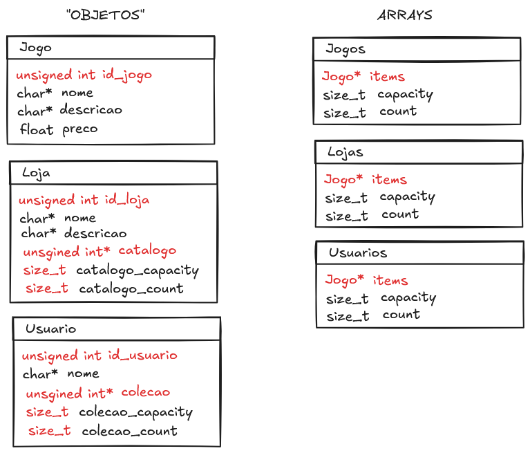

# projeto_N1_PROG_ESTRUT_V2
Projeto para composição da nota N1 da disciplina de Programação Estruturada, segunda iteração

## Estrutura de Dados

    

Para o projeto, decidimos construir os dados de duas formas: as <bold><bold>estruturas em si<bold><bold>, contendo os campos e variáveis próprias, e um <bold><bold>controle de array<bold><bold> para a estrutura. 

Por exemplo, a estrutura <bold>Jogo</bold> contém os campos <bold>id_jogo</bold>, <bold>nome</bold>, <bold>descricao</bold> e <bold>preco</bold>. E para controlar um array dinâmica de jogos, utilizamos a estrutura <bold>Jogos</bold>, a qual contem um ponteiro de <bold>Jogo</bold>, a capacidade do array e um contador para o número de items ocupados no array.
Dessa maneira é possível alocar responsabilidades diferentes para estruturas distintas.

## Fluxograma
